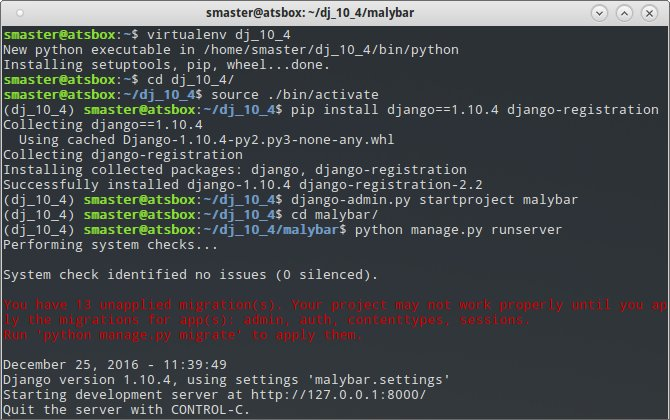
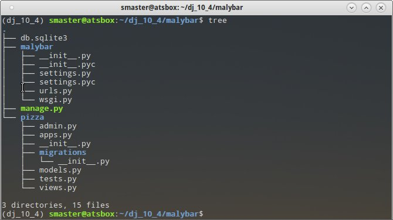

Django
#######

`Django <https://www.djangoproject.com/>`_ to napisany w Pythonie framework
przeznaczony do szybkiego tworzenia aplikacji internetowych.
Został zaprojektowany przez zespół doświadczonych praktyków w taki sposób,
żeby odciążyć programistę od wykonywania typowych, a jednocześnie uciążliwych czynności.
Zalety Django to szybkość, bezpieczeństwo i skalowalność. Inne cechy wymienione są
na polskiej stronie Wikipedii: `Django (framework) <https://pl.wikipedia.org/wiki/Django_(framework)>`_.

Przygotowanie środowiska
========================

Do pracy z Django potrzebny jest przede wszystkim **interpreter Pythona 2.7.x**.
Jest on domyślnie obecny w systemach Linux. Natomiast w systemach Windows i Mac OS X
należy wejść na stronę `Donwload Python <https://www.python.org/downloads/>`_,
pobrać odpowiedni instalator (32- lub 64-bitowy) Pythona (**wersja 2.7.x**!)
i zainstalować. Opis instalacji znajdziesz na stronie `Interpreter Pythona <http://python101.readthedocs.io/pl/latest/env/windows.html#inerpreter-pythona>`_.

Poza Pythonem potrzebny jest również instalator pakietów Pythona `pip`.
W systemach Linux wywodzących się z Debiana (Ubuntu, Linux Mint)
wystarczy wydać w terminalu polecenie:

.. code-block:: bash

    ~$ sudo apt install python-pip

W systemie Windows `pip` jest instalowany razem z interpreterem.
Korzystając z omawianego narzędzia wydajemy w konsoli tekstowej polecenie:

.. code-block:: bash

    ~$ sudo pip install virtualenv

Narzędzie `virtualenv` posłuży nam do przygotowania **wyizolowanego środowiska Pythona**,
zawierającego wybraną wersję Django. W konsoli wydajemy polecenia:

.. code-block:: bash

		~$ virtualenv dj_10_4
		~$ cd dj_10_4
		~$ source ./bin/activate
		~$ pip install Django==1.10.4
		~$ pip install django-registration

Pierwsze polecenie tworzy katalog zawierający najważniejsze komponenty Pythona.
Nazwa :file:`dj_10_4` jest umowna, w założeniu ma być skrótem wskazującym wykorzystaną
wersję Django. Aby skorzystać z przygotowanego środowiska, należy
go zawsze na początku aktywować, wydając w utworzonym katalogu polecenie ``source ./bin/activate``.
Opuszczenie środowiska umożliwia komenda ``deactivate``.

Polecenia ``pip install ...`` instalują wskazaną wersję Django oraz dodatkową aplikację
ułatwiającą zarządzanie użytkownikami. Tak zainstalowane moduły będą dostępne
tylko w aktywowanym środowisku.

Ćwiczenie
---------

Zgodnie z powyższym opisem przygotuj samodzielnie wirtualne środowisko do pracy z Django.

.. tip::

	Projektując aplikację będziemy często korzystać z poleceń wydawanych w katalogu
	:file:`dj_10_4` w terminalu. Nie zamykaj więc okna terminala.

Projekt
========

Otwórz terminal, przejdź do katalogu z utworzonym wcześniej wirtualnym środowiskiem
:file:`dj_10_4` i aktywuj go. Utworzymy teraz projekt i uruchomimy serwer deweloperski.
Wydajemy polecenia:

.. code-block:: bash

    ~/dj_10_4$ django-admin stratproject malybar
    ~/dj_10_4$ cd malybar
    ~/dj_10_4/malybar$ python manage.py runserver

Tyle wystarczy, żeby utworzyć szkielet serwisu i uruchomić serwer deweloperski,
który możemy wywołać wpisując w przeglądarce adres: ``127.0.0.1:8000``.
Większość zmian w kodzie nie wymaga restartowania serwera. W razie potrzeby
serwer zatrzymujemy naciskając w terminalu skrót :kbd:`CTRL+C`.

Poznajmy strukturę plików naszego projektu. W terminalu wydajemy jedno z poleceń:

.. code-block:: bash

  ~/dj_10_4/malybar$ tree
	~/dj_10_4/malybar$ ls -R

Nazwa zewnętrznego katalogu :file:`malybar` nie ma znaczenia, można ją dowolnie zmieniać,
to tylko pojemnik na projekt. Zawiera on:

	- :file:`manage.py` – skrypt Pythona do zarządzania projektem;
	- :file:`db.sqlite3` – bazę danych w domyślnym formacie SQLite3.

**Katlog projektu** :file:`malybar/malybar` zawiera:

	- :file:`settings.py` – konfiguracja projektu;
	- :file:`urls.py` – swego rodzaju "menu" naszego projektu, a więc lista wpisów
	  definiująca adresy URL, które będziemy obsługiwać;
	- :file:`wsgi.py` – plik konfiguracyjny wykorzystywany przez serwery WWW.

Plik :file:`__init__.py` obecny w danym katalogu wskazuje, że dany katalog jest modułem Pythona.

Aplikacja
=========

W ramach jednego projektu (serwisu internetowego) może działać wiele aplikacji.
Utworzymy teraz naszą aplikację `pizza` i zobaczymy strukturę plików:

.. code-block:: bash

	~/dj_10_4/malybar$ python manage.py startapp pizza
	~/dj_10_4/malybar$ tree pizza
	lub:
	~/dj_10_4/malybar$ ls -R pizza

**Katalog aplikacji** :file:`malybar/pizza` zawiera:

	- :file:`apps.py` – ustawienia aplikacji;
	- :file:`admin.py` – konfigurację panelu administracyjnego;
	- :file:`models.py` – plik definiujący modele danych przechowywanych w bazie;
	- :file:`views.py` – plik zawierający funkcje lub klasy definiujące tzw. *widoki* (ang. *views*), obsługujące żądania klienta przychodzące do serwera;

Ustawienia projektu
===================

Otwieramy i edytujemy plik :file:`malybar/settings.py`.

**Dostępne w projekcie aplikacje** znajdują się w liście ``INSTALLED_APPS``. Domyślnie Django udostępnia
kilka obsługujących podstawowe funkcjonalności serwisu internetowego. Na początku tej listy
dodamy konfigurację aplikacji `pizza`, na końcu zainstalowanej wcześniej `django-registration`:

.. raw:: html

	
Kod nr : <i>malybar/settings.py</i>

.. highlight:: python
.. literalinclude:: malybar/settings_01.py
    :linenos:
    :lineno-start: 33
    :lines: 33-42
    :emphasize-lines: 2, 9

**Lokalizacja projektu** obejmuje ustawienie języka i strefy czasowej:

.. raw:: html

	
Kod nr : <i>malybar/settings.py</i>

.. highlight:: python
.. literalinclude:: malybar/settings_01.py
    :linenos:
    :lineno-start: 107
    :lines: 107-109

**Konfiguracja adresów URL projektu** zawarta jest w pliku :file:`malybar/urls.py`. Każda aplikacja definiuje
zazwyczaj swoją listę obsługiwanych adresów, którą należy dołączyć:

.. raw:: html

    
Kod nr 

.. highlight:: python
.. literalinclude:: malybar/urls_01.py
    :linenos:
    :lineno-start: 16
    :lines: 16-24
    :emphasize-lines: 3, 6-7

Funkcja ``include()`` jako pierwszy parametr przyjmuje ścieżkę dostępu do konfiguracji adresów danej
aplikacji. W praktyce jest to nazwa katalogu, w którym znajduje się aplikacja, operator ``.`` (kropka)
oraz domyślna nazwa pliku konfiguracyjnego :file:`urls.py` bez rozszerzenia.
Wartość parametru ``namespace`` definiuje przestrzeń nazw, w której dostępne będą adresy używane w aplikacji.

Widok domyślny
==============

**Mapowanie adresów URL aplikacji** tworzymy w nowym pliku :file:`pizza/urls.py`,
który wypełniamy następującym kodem:

.. raw:: html

    
Kod nr 

.. highlight:: python
.. literalinclude:: pizza/urls_01.py
    :linenos:
    :lineno-start: 1
    :lines: 1-
    :emphasize-lines: 2, 5

Lista ``urlpatterns`` zawiera powiązania między adresami URL a obsługującymi je widokami
zapisanymi w pliku :file:`views.py`, który importujemy w drugiej linii.

Funkcja ``url()`` przyporządkowuje adresowi URL widok, który go obsługuje. Pierwszy parametr to wyrażenie
regularne, do którego Django próbuje dopasować adres otrzymany w żądaniu od klienta. Drugi to nazwa widoku.
Trzeci to unikalna nazwa, dzięki której można odwoływać się w aplikacji do zdefiniowanego adresu.

**Widok** definiuje jakiś typ strony WWW, za pomocą którego użytkownik wykonuje w aplikacji
jakieś operacje, np. wyświetla zestawienie danych. Technicznie widok zazwyczaj składa się
z funkcji otrzymującej żądanie klienta i jakiegoś szablonu służącego prezentowaniu danych.

Widok domyślny obsługujący żądania typu GET przychodzące na adres podstawowy serwera
zdefiniujemy w pliku :file:`pizza/views.py`:

.. raw:: html

    
Kod nr 

.. highlight:: python
.. literalinclude:: pizza/views_01.py
    :linenos:
    :lineno-start: 1
    :lines: 1-

.. attention::

	**Zapamiętaj:**

	- linia ``# -*- coding: utf-8 -*-`` to określenie kodowania znaków. Należy umieszczać je w pierwszej linii każdego pliku, w którym zamierzamy używać polskich znaków, czy to w komentarzach czy w kodzie.
	- napisy zawierające polskie znaki poprzedzamy literą `u`, np. ``u'składnik'``.

Nazwa funkcji – ``index()`` – jest umowna. Każdy widok otrzymuje szczegóły żądania wysłanego przez klienta
(obiekt typu ``HttpRequest``) i powinien zwrócić jakąś odpowiedź (``HttpResponse``).
W tym wypadku zwracamy funkcję ``render()`` wywołującą wskazany jako drugi parametr szablon,
który otrzymuje dane w postaci słownika ``kontekst`` (nazwa umowna).

**Szablon** (ang. *template*) – to plik tekstowy, służący generowaniu najczęściej plików HTML.
Oprócz tagów HTML-a, zawiera zmienne oraz tagi sterujące języka szablonów Django.

.. note::

	Szablony umieszczamy w katalogu: :file:`pizza/templates/pizza`!

Zawartość szablonu :file:`index.html`:

.. raw:: html

    
Kod nr 

.. highlight:: html
.. literalinclude:: pizza/templates/pizza/index_01.html
    :linenos:
    :lineno-start: 1
    :lines: 1-

Zobacz, jak w znaczniku ``
`` wstawiamy przekazaną do szablonu zmienną ``komunikat``,
używamy podwójnych nawiasów sześciennych: ``{{ nazwa_zmiennej }}``.

.. tip::

	W tym miejscu warto usystematyzować dodawanie kolejnych funkcji do naszej aplikacji.
	**Zazwyczaj** proces ten przebiega wg. schematu:

	1) w pliku :file:`urls.py`: przyporządkowujemy adres widokowi;
	2) w pliku :file:`views.py`: definiujemy widok, który najczęściej zwraca szablon połączony z przekazanymi do nego danymi;
	3) w katalogu :file:`templates/nazwa_aplikacji`: tworzymy szablon, który łączy znaczniki HTML-a i dane.

Test widok domyślnego
---------------------

W tym momencie powinieneś przetestować działanie aplikacji. Sprawdź, czy działa serwer. Jeżeli
nie, uruchom go. W przeglądarce odśwież lub wpisz adres domyślny serwera testowego, tj.:
``127.0.0.1:8000``. Powinieneś zobaczyć nazwę projektu i powitanie.

W przypadku błędów Django wyświetla obszerne informacje, które na pierwszy rzut oka
są bardzo skomplikowane. Nie musisz studiować całości, żeby zrozumieć, co poszło nie tak.
Skup się na początku komunikatu!

Model danych
============

Podstawą użytecznej aplikacji są dane. Django realizuje obiektowy wzorzec programowania,
więc dane definiujemy jako klasy opisujące tzw. modele.
**Model danych** – to kompletne źródło informacji o jakimś obiekcie, zawiera jego właściwości
(pola) oraz metody działań na nich.

W pliku :file:`pizza/models.py` definiujemy klasy opisujące źródła danych naszej aplikacji:

.. raw:: html

    
Kod nr 

.. highlight:: python
.. literalinclude:: pizza/models_01.py
    :linenos:
    :lineno-start: 1
    :lines: 1-

Nazwa każdego modelu (klasy) powinna zaczynać się dużą literą. Każdy model jest potomkiem
klasy Models (dziedziczenie). Definicja każdej zmiennej (właściwości) zawiera wywołanie
metody tworzącej pole wymaganego typu. Za pomocą nazwanych argumentów określamy dodatkowe cechy pól.

.. note::

	Najczęstsze typy pól:

	- ``CharField`` – pole znakowe, przechowuje niezbyt długie napisy, np. nazwy;
	- ``TextField`` – pole tekstowe, dla długich tekstów, np. opisów;
	- ``DecimalField`` – pole dziesiętne, nadaje się do przechowywania liczb rzeczywistych, np. cen;
	- ``Date(Time)Field`` – pole daty (i czasu);
	- ``BooleanField`` – pole logiczne, przechowuje wartość ``True`` lub ``False``;
	- ``ForeignKey`` – pole klucza obcego, czyli relacji; wymaga nazwy powiązanego modelu jako pierwszego argumentu.

	Właściwości pól:

	- ``verbose_name`` lub napis podany jako pierwszy argument – przyjazna nazwa pola;
	- ``max_length`` – maksymalna długość pola znakowego;
	- ``blank = True`` – pole może zawierać ciąg pusty;
	- ``help_text`` – tekst podpowiedzi;
	- ``max_digits``, ``decimal_places`` – określenie maksymalnej ilości cyfr i ilości miejsc po przecinku liczby rzeczywistej;
	- ``auto_now_add = True`` – data (i czas) wstawione zostaną automatycznie;
	- ``default`` – określenie wartości domyślnej pola;
	- ``choices`` – wskazuje listę wartości dopuszczalnych dla danego pola.

W bazie chcemy przechowywać dane o pizzach. Każda z nich składać się może z wielu składników.
Tak więc między modelami `Pizza` i `Skladnik` istnieje relacja jeden-do-wielu.

Po dokonaniu zmian w bazie tworzymy tzw. *migrację*, w terminalu wydajemy polecenia:

.. code-block:: bash

  ~/dj_10_4/malybar$ python manage.py make migrations pizza
  ~/dj_10_4/malybar$ python manage.py migrate

**Migracja** – tworzona przez pierwsze polecenie, to informacje o zmianie w bazy danych zapisywana
przez Django w języku SQL w katalogu :file:`pizza/migrations`.

Drugie polecenie na podstawie migracji wszystkich zarejestrowanych aplikacji (w tym domyślnych)
buduje lub aktualizuje bazę danych. Z nazw modeli Django utworzy odpowiednie tabele, w oparciu o zdefiniowane
właściwości – odpowiednie kolumny.

Zmiany modeli
-------------

1. Do modelu `Pizza` dodamy pole przechowujące użytkownika, który dodał ją do bazy.

	- przed definicjami klas dodaj import ``from django.contrib.auth.models import User``
	- dodaj klucz obcy o nazwie ``autor`` wskazujący na model ``User``

2. Dodamy możliwość "autoprezentacji" modeli, czyli wyświetlania ich znakowej reprezentacji.

	- do każdej klasy dodaj następującą metodę:

.. code-block:: python

      def __unicode__(self):
        return u'%s' % (self.nazwa)

3. W panelu administracyjnym przydatna jest forma liczby mnogiej służąca nazywaniu egzemplarzy danego modelu.

	- w każdym modelu umieść dodatkową klasę `Meta` z odpowiednią formą liczby mnogiej, np.:

.. code-block:: python

      class Meta:
        verbose_name_plural = 'pizze'

4. Na koniec utwórz migrację aplikacji i zaktualizuj bazę danych!

Strona administracyjna
======================

Zarządzanie treściami czy użytkownikami wymaga panelu administracyjnego, Django dostarcza nam
go automatycznie.

**Konto administratora** tworzymy, wydając w terminalu polecenie:

.. code-block:: bash

  ~/dj_10_4/malybar$ python manage.py createsuperuser

Django zapyta o nazwę, e-mail i hasło. Podajemy: `admin`, `""` (pomijamy), `q1w2e3r4`.

Aplikacja w panelu administratora: uzupełniamy plik :file:`pizza/admin.py`:

.. highlight:: python
.. literalinclude:: pizza/admin_01.py
    :linenos:
    :lineno-start: 1
    :lines: 1-

Po zaimportowaniu modeli danych rejestrujemy je w panelu, dzięki temu będziemy mogli dodawać
i modyfikować dane użytkowników i aplikacji.

Zarządzanie danymi
------------------

1. Uruchom serwer i wywołaj w przeglądarce adres: ``127.0.0.1:8000/admin``.
2. Zaloguj się jako administrator, dodaj dwie pizze i przynajmniej po jednym składniku do każdej.
3. Utwórz konto dla użytkownika "uczen" z hasłem "q1w2e3r4". Przydziel mu prawa do dodawania, modyfikowania i usuwania pizz i składników. Uwaga: nie zapomnij zaznaczyć opcji "W zespole"!
4. Zaloguj się na konto "uczen" i dodaj jeszcze jedną pizzę z co najmniej jednym składnikiem.

.. note::

	Obsługa panelu administracyjnego jest dobrą okazją, żeby zobaczyć jak wygląda komunikacja
	między klientem a serwerem w aplikacjach sieciowych wykorzystujących protokół http.
	Serwer testowy wyświetla pełen zapis sesji w oknie terminala.

	[zrzut]

Użytkownicy
===========

Do zarządzania użytkownikami użyjemy zainstalowanej na początku aplikacji `django-registration`.
W pliku :file:`malybar/settings.py` dodaliśmy ją już do listy aplikacji ``INSTALLED_APPS``.
Teraz na końcu tego pliku dodamy kilka ustawień:

.. raw:: html

	
Kod nr : <i>malybar/settings.py</i>

.. highlight:: python
.. literalinclude:: malybar/settings_02.py
    :linenos:
    :lineno-start: 124
    :lines: 124-127

Następnie włączamy konfigurację adresów URL aplikacji do pliku :file:`malybar/urls.py`:

.. raw:: html

	
Kod nr 

.. highlight:: python
.. literalinclude:: malybar/urls_02.py
    :linenos:
    :lineno-start: 20
    :lines: 20-25
    :emphasize-lines: 4

Teraz możemy zobaczyć, jakie adresy udostępnia aplikacja `django-registration`,
wpisując w przeglądarce adres ``127.0.0.1:8000/konta/``:

[zrzut]

Jak widać, mamy do dyspozycji m.in następujące adresy:

	- ``/konta/register`` o nazwie ``registration_register`` – do tworzenia konta;
	- ``/konta/login`` o nazwie ``auth_login`` – do logowania;
	- ``/konta/logout`` o nazwie ``auth_logout`` – do wylogowywania.

Szablony
-----------

Na początku utworzymy szablon służący do rejestracji w pliku
:file:`pizza/templates/registration/registration_form.html`:

.. raw:: html

	
Kod nr 

.. highlight:: html
.. literalinclude:: pizza/templates/registration/registration_form_01.html
    :linenos:
    :lineno-start: 1
    :lines: 1-

W powyższym kodzie widać, w jaki sposób używamy przygotowanych wcześniej formularzy
w szablonach. Znacznik HTML-a ``<form>`` i przycisk typu ``submit`` musimy wstawić sami,
resztę może za nas zrobić Django:

	- ```` – ten tag dodaje ukryte pole zabezpieczające formularz przed atakami typu `CSRF <https://pl.wikipedia.org/wiki/Cross-site_request_forgery>`_;
	- ``{{ form.as_p }}`` – metoda ``as_p`` renderuje przekazany do szablonu w zmiennej ``form`` formularz przy użyciu znaczników akapitów ``
``.

Potrzebujemy również szablonu logowania, który umieszczamy w pliku
:file:`pizza/templates/registration/login.html`:

.. raw:: html

	
Kod nr 

.. highlight:: html
.. literalinclude:: pizza/templates/registration/login_01.html
    :linenos:
    :lineno-start: 1
    :lines: 1-

Adresy URL wstawiamy w szablonach za pomocą tagu ``url``, który jako pierwszy obowiązkowy argument
przyjmuje nazwę adresu zdefiniowaną w argumencie ``name`` w plikach :file:`urls.py`.

.. attention::

	**Zapamiętaj**: nawiasy ``{{ zmienna }}`` służą do wstawiania wartości zmiennych,
	nawiasów ```` używamy do tagów języka szablonów.

Na koniec szablon wyświetlany po wylogowaniu, czyli plik
:file:`pizza/templates/registration/logout.html`:

.. raw:: html

	
Kod nr 

.. highlight:: html
.. literalinclude:: pizza/templates/registration/logout_01.html
    :linenos:
    :lineno-start: 1
    :lines: 1-

Testowanie
----------

Po dodaniu szablonów można już przetestować tworzenie konta, logowanie i komunikat po wylogowaniu
wpisując w przeglądarce po nazwie serwera ``127.0.0.1:8000`` adresy:

	- ``/register`` – tworzenie nowego konta; utwórz konto `ewa` z hasłem `q1w2e3r4`;
	- ``/login`` – logowanie; zaloguj się na utworzone wcześniej konto `uczen`;
	- ``/logut`` – potwierdzenie wylogowania;

Spróbuj wstawić do szablonu :file:`pizza/index.html` odnośniki do powyższych adresów.
Na końcu pliku umieść kod:

.. code-block:: html

  <ul>
	
	  <li><a href="">Zaloguj się</a></li>
	  <li><a href="">Utwórz konto</a></li>
	
	  <li><a href="">Wyloguj się</a></li>
	
	</ul>

– i zamień tekst `nazwa_adresu` na właściwe nazwy adresów URL.

.. attention::

	**Zapamiętaj**: w szablonach dostępne są konstrukcje warunkowe wstawiane za pomocą tagów
	`` ...  ... ``.
	W szablonach dostępny jest obiekt ``user`` zawierający informacje o użytkowniku.
	Metoda ``is_authenticated`` zwraca prawdę, jeżeli użytkownik został zalogowany.

Widok ListView
==============

Praktycznie w każdym serwisie występują strony zawierające zestawienie danych.
Utworzymy więc widok prezentujący listę pizz.

**Definicja adresu** – w pliku :file:`urls.py` dodajemy importy:

.. raw:: html

	
Kod nr 

.. highlight:: python
.. literalinclude:: pizza/urls_02.py
    :linenos:
    :lineno-start: 3
    :lines: 3-5

Następnie przyporządkowujemy adres ``lista/`` o nazwie ``lista`` widokowi `ListView`, dodając kod:

.. raw:: html

	
Kod nr 

.. highlight:: python
.. literalinclude:: pizza/urls_02.py
    :linenos:
    :lineno-start: 7
    :lines: 7-14
    :emphasize-lines: 3-7

Widoki generyczne (ang. *generic views*) to udostępniane przez Django widoki służące przygotowywaniu typowych
stron WWW. `ListView` – jak wskazuje nazwa – tworzy stronę z listą obiektów. Argumenty widoku:

 - ``model`` – wskazuje model obiektów, które mają być wyświetlane;
 - ``context_object_name`` – określa nazwę, pod którą lista obiektów będzie dostępna w szablonie (domyślnie ``objects``);
 - ``paginate_by`` – określa maksymalną liczbę obiektów wyświetlanych na stronie.

.. note::

	Widoki generyczne są klasami. Jeżeli używamy ich w pliku :file:`urls.py`,
	musimy użyć ich metody ``as_view()``, aby potraktowane zostały jak funkcje.

Jeżeli chcemy, aby jakiś adres dostępny był tylko dla zalogowanych użytkowników,
wywołanie widoku umieszczamy w funkcji ``login_required()``.

Widok `ListaView` wymaga szablonu o schematycznej nazwie `nazwa_modelu_list.html`.
Tworzymy więc plik :file:`templates/pizza/pizza_list.html` o zawartości:

.. raw:: html

	
Kod nr 

.. highlight:: html
.. literalinclude:: pizza/templates/pizza/pizza_list_01.html
    :linenos:
    :lineno-start: 1
    :lines: 1-

Konstrukcję ``for p in pizze`` należy rozumieć następująco:
`dla każdego obiektu pobranego z listy pizze do zmiennej p wykonaj:`.
W pętli wyświetlamy kolejne zmienne: numer iteracji (``forloop.counter``),
nazwę, autora i datę dodania pizzy. Jeżeli zalogowany użytkownik dodał daną pizzę,
wyświetlamy odnośniki umożliwiające edycję i usuwanie obiektów.

.. attention::

	Zapamiętaj: tagów `` ... `` używamy w szablonach,
	jeżeli potrzebujemy pętli.

Na koniec dodaj do szablonu :file:`index.html` odnośnik do listy. Użyj kodu:

.. code-block:: html

    

Zwróć uwagę, że nazwa URL-a poprzedzona została nazwą przestrzeni nazw, którą zdefiniowaliśmy
w parametrze ``namespace`` podczas włączania listy adresów naszej aplikacji do listy projektu.

[zrzut]

Create View
===========

Zajmiemy się teraz możliwością dodawania danych, czyli pizz i składników.
Na początku utworzymy nowy plik :file:`pizza/forms.py`, z następującą zawartością:

.. raw:: html

	
Kod nr 

.. highlight:: html
.. literalinclude:: pizza/forms_01.py
    :linenos:
    :lineno-start: 1
    :lines: 1-

Pliki o nazwie :file:`forms.py` służą do definiowania formularzy. Klasa `PizzaForm`
pozwala dostosować cechy formularza, który posłuży do dodawania i edytowania pizz.
W podklasie `Meta` definiujemy:

	- ``model`` – model, dla którego dostosowujemy formularz;
	- ``fields`` – tupla zawierająca listę pól modelu, które znajdą się w formularzu;
	- ``exclude`` – tupla z polami, które wykluczamy z formularza;
	- ``widgets`` – opcjonalny słownik, w którym ustalamy właściwości widżetów HTML.

Jeżeli tworzymy formularz w na podstawie modelu, Django potrafi wygenerować widżety HTML
odpowiadających typom pól. Np. pola ``CharField`` reprezentowane są przez tagi ``<input>``,
a pola ``TextField`` przez ``<textarea>``. W powyższym przykładzie określiliśmy,
że pole opis będzie reprezentowane przez ... [todo]